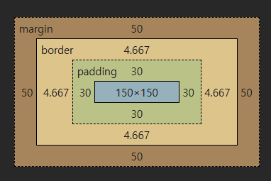

# Frontend

> 날짜: 2026.09.16

---

## CSS

### 1. 선택자

- 전체 선택자
- 태그 선택자
- 클래스 선택자
- 아이디 선택자

### 2. 복합 관계 선택자

- 하위 선택자
- 자식 선택자 (부모 > 자식)
- 일반 형제 선택자 (형 ~ 동생)
- 인접 형제 선택자 (형 + 동생)
- 그룹 선택자 (,)
- 속성 선택자
  - `[속성명]` : 지정된 속성이 있으면 선택 (다른 선택자와 조합해서 주로 사용)
  - `[속성명="값"]` : 속성의 값이 일치하는 요소 선택
  - `[속성명^="값"]` : 값으로 시작하는 요소
  - `[속성명$="값"]` : 값으로 끝나는 요소
  - `[속성명*="값"]` : 값이 포함된 요소

### 3. 가상 클래스 선택자

**가상 선택자 (위치)**

- `:first-child` : 첫 번째 자식 요소 (타입이 달라도 선택됨)
- `:last-child` : 마지막 자식 요소
- `:nth-child(숫자)` : 숫자 위치에 있는 요소 선택
- `:nth-child(수식)` : 수식에 해당하는 요소 선택
  - `2n+1` → 홀수
  - `3n+1` → 3번마다 1번씩 선택
  - `2n` → 짝수
- `of-type`이 붙으면 같은 타입끼리만 선택 (예: `:nth-of-type`)
- `:only-of-type` : 자식 요소가 1개만 있는 경우 선택

**조건 선택자**

- `:not(선택자)` : 지정된 선택자가 아닌 요소 선택
- `:is(선택자1, 선택자2, ...)` : 상위 요소 그룹 → 하위 요소를 선택할 때 사용

**상태 선택자**

- `:hover` : 마우스가 요소 위에 올라간 상태
- `:focus` : 특정 요소가 선택되어 커서가 있는 상태
- `:checked` : 체크된 상태
- `:read-only` : 읽기 전용 상태
- `:disabled` : 비활성 상태

**요소 추가 선택자 (`::`)**

- `::before` : 자식의 첫 번째 요소로 추가
- `::after` : 자식의 마지막 요소로 추가
  - 반드시 추가할 내용이 있어야 노출됨 (`content` 필수)
  - inline 속성
- `::placeholder` : 가이드라인 텍스트
- `::selection` : 선택된 영역

---

## CSS 속성

### 텍스트 및 폰트 속성

- **color** : 폰트 색상
  - 색상명 (red, blue...)
  - rgb(0~255, 0~255, 0~255)
  - 16진법 표기 (HEXCODE)
  - rgba(0~255, 0~255, 0~255, 0~1) — 0에 가까우면 투명, 1은 불투명

- **font-size** : 글자 크기
  - 절대 크기
    - px (픽셀)
    - pt (인쇄 기준)
  - 상대 크기
    - em : 상위 태그에 지정된 폰트 사이즈 기준
    - rem : 가장 상위 태그(html)의 글자 사이즈 기준 (html 기본 1rem = 지정 px)

---

## CSS 박스 모델

- 150x150 부분 : 콘텐츠 (기본 설정으로 너비/높이의 기준)
  - 내부 여백(padding)이나 경계선(border)을 지정하면 박스 크기는 커짐

- **padding** : 내부 여백 (경계선 안쪽)
- **margin** : 외부 여백 (경계선 바깥쪽)

### box-sizing : 너비/높이의 기준

1. `content-box` (기본값) : 내용 영역(content) 기준
2. `border-box` : 경계선(border) 기준

### 외부 여백 (margin)

- block 속성 태그 : 제한 없음
- inline 속성 태그 : 위/아래 여백 없음, 좌/우 여백만 적용

**단축 속성 순서**
- `margin: 상 우 하 좌;`
- `margin: 상 좌우 하;`
- `margin: 상하 좌우;`
- `margin: 값;`

**방향**
- top(위) / bottom(아래) / left(좌) / right(우)

예)
- `margin-top: 50px;` → 위로 50px 외부 여백
- `padding-top: 50px;` → 위로 50px 내부 여백
- `margin: 100px auto;` → 위/아래 100px, 좌/우는 균등하게 여백

---

## Display

- **block** : block이 아닌 속성 → block으로 변경
- **inline** : inline이 아닌 속성 → inline으로 변경
- **inline-block** : 줄바꿈 없음, 공간 있음, 외부 여백(위/아래/좌/우) 적용
- **none** : 공간 없이 감춤

> 참고 - `visibility`
> - `visible` (기본값)
> - `hidden` : 감추되 공간은 유지

---

## Flexbox (1차원 정렬)

- 설정 : 부모 요소에 `display: flex;`
- 적용 : 자식 요소에 정렬 속성

### 정렬 방향

- `flex-direction: row;` (기본값) — 좌 → 우
- `flex-direction: row-reverse;` — 우 → 좌
- `flex-direction: column;` — 위 → 아래 (reverse는 반대)

### 정렬 속성 제어

**justify-content**
1. `flex-start` : 왼쪽 정렬
2. `flex-end` : 오른쪽 정렬
3. `center` : 가운데 정렬
4. `space-between` : 좌우 끝 요소를 배치, 나머지는 균등한 공백
5. `space-around`
6. `space-evenly`

**align-items** — 자식 요소들의 배치(세로축)
- `stretch` (기본값) : 부모 요소 크기에 맞춰 늘림
- `flex-start` : 위쪽 배치
- `flex-end` : 아래쪽 배치
- `center` : 가운데 배치

flex - grow
1. 자식요소 적용.
2. 남아 있는 공백을 차지할 비율 설정

flex -shrink
1. 부모요소의 공간이 부족할때 줄여주는 자식요소의 크기 줄임 비율
2. 비율 가중치
3. 0: 요소를 축소x
4. flex -basis: 요소의 기본 사이즈 (auto-기본값)