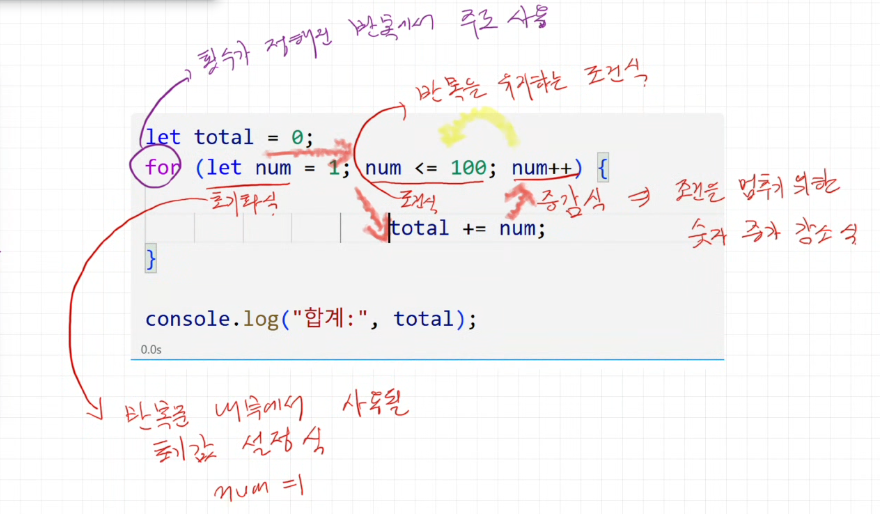

# JavaScript

> 날짜: 2026.09.22

---

## 기본 연산자

### 증가 감소 연산자 (++, --)
- `++` : 1씩 증가
- `--` : 1씩 감소
- `let num2 = num++;` → 대입(1) → 증가(2) *(먼저 대입, 나중에 증가)*
- `let num2 = ++num;` → 증가(1) → 대입(2) *(먼저 증가, 나중에 대입)*

### 일치 연산자 (===, !==)
- 동등성 비교(`==`) vs 동일성 비교(`===`, 권장)
- `!` : 부정 연산 (참 → 거짓, 거짓 → 참)
- `!=` : 값이 다르다
- `!==` : 값 또는 타입(주소)이 다르다

### 논리 연산자
- `&&` : AND 연산자 (단락 회로 평가를 이용해 간단한 조건식 수행 가능)
- `||` : OR 연산자
- `!` : NOT 연산 (부정 연산)

---

## 제어문

### 조건문
조건식: 참/거짓을 판별하는 연산식 (주로 비교, 논리 연산 사용)

```javascript
if (조건식) {
  // 조건식이 참일 때 실행
}
```

```javascript
if (조건식) {
  // 참일 때 실행
} else if (조건식2) {
  // 조건식2가 참일 때 실행
} else {
  // 모든 조건이 거짓일 때 실행
}
```

**삼항 조건식**
```javascript
변수 = (조건식) ? 참일 때 값 : 거짓일 때 값;
```

**nullish 연산자 (`??`)**
- `null`, `undefined`일 때만 판단

### 선택문
- `switch ~ case` : `case` 키워드에 매칭되면 그 지점부터 실행 시작, `break`를 만날 때까지 계속 실행
- `break` : 실행 흐름 중단
- `default` : 매칭되는 `case`가 없을 때 실행되는 구간

### 반복문

- 순서의 의미가 강한 반복문은 관례적으로 변수명을 `i`(index)로 사용
  - index: 0부터 시작하는 순서
- 중첩될 경우 다음 변수명은 알파벳 순서로 (`j`, `k`, `l`, `m` ...)

**흐름 제어**
- `break` : 반복 중단
- `continue` : 해당 회차 건너뛰기

### while문
```javascript
while (조건식) {
  // 조건식이 참일 때 반복
  // 반복을 중단시키는 코드가 반드시 필요 (break와 함께 사용)
}
```

### do while문
- 조건식이 거짓이어도 최소 한 번은 실행됨

```javascript
do {
  // 최소 1회 실행 후, 조건식이 참이면 반복
} while (조건식);
```

---

## 예외처리 (try - catch - finally)

```javascript
try {
  // 예외가 발생할 가능성이 있는 코드
} catch (err) {
  // 예외 발생 시 실행되는 대안 처리 구간
  // err: 발생한 예외에 대한 정보
} finally {
  // 예외 발생 여부와 상관없이 무조건 실행
}
```

- `throw` : 예외를 직접 발생시킴
  - `throw new 예외객체(...)` → `Error`의 하위 생성자 객체를 사용

---

## 객체 리터럴

### 객체란? (Object)
자바스크립트의 자료형은 크게 두 가지로 나뉜다.
- 원시 타입
- 객체 타입

### 객체의 개념과 빈 객체 생성
- 프로퍼티 (Property)
- 키(Key)와 값(Value)
- 빈 객체 생성

### 프로퍼티 읽기와 조작 (추가, 수정, 삭제)

**마침표(`.`) 연산자**
- 속성 이름이 변수명 규칙에 해당할 때만 접근 가능

**변수명 규칙**
- 알파벳(대소문자), 숫자, `_`, `$`로만 구성
- 숫자로 시작 불가
- 예약어(`if`, `throw` 등)는 사용 불가

**변수명 관례**
- 여러 단어로 구성된 변수: `noOfStudent` → 카멜 케이스
- 여러 단어로 구성된 상수(`const`): `NO_OF_STUDENT` → 스네이크 케이스(대문자)

**함수명 관례**
- 변수명 관례와 동일
- 생성자로 사용되는 함수는 첫 글자를 대문자로 (예: `OrderItem`)

**대괄호(`[]`) 연산자**
- 변수명 규칙에 해당하지 않는 속성에 접근할 때 사용
- 존재하지 않는 프로퍼티에 접근할 때도 사용