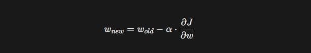

# 머신러닝

>날짜: 2026.08.26
----

## 선형 회귀 모델과 오차 평가지표

### 선형 회귀
- 원인(입력값)과 결과(정답) 사이에 비례하는 규칙이 있다고 가정하고, 이를 가장 잘 나타내는 '직선'을 그어 미래를 예측하는 머신러닝 기법

1. 예측을 위한 마법의 공식
- y = wx + b
    - w,b -> 모델 파라미터(모델이 학습을 통해서 결정한값)

### 오차와 손실 함수
1. 예측을 잘하면 오차(Error) 작다.
2. Loss - 오차의 대푯값 
- 대푯값을 구하는 공식(Loss Fucntion)
    - MSE (Mean Squared Error) : 평균 제곱 오차
        - 곡선: 미분 가능(최적의 가중치 결정)
        - 이상치에 민감 ex) 작은값 더작게 큰 값 더 크게
    - MAE (Mean Absolute Error) : 평균 절대값 오차
        - 미분 어려움.
        - 직관적인 크기 확인 가능

#### Loss
- 모델이 예측한 값이 실제 정답과 얼마나 다른지 나타내는 값이다.
#### 가중치
- 모델이 데이터를 가지고 측할떄 사용
#### 미분
- 가중치를 어느 방향으로 바꿔야 Loss가 작아지는지 알아데는데 사용

### 경사하강법
- 오차라는 이름의 거대한 산에서, 가장 깊은 골짜기를 향해 한 걸음씩 내려가는 길 찾기 알고리즘 이다.
- Loss가 가장 작아지는 지점을 찾아가기 위해 가중치를 조절하는 방법이다.

### 경사하강법의 움직임 공식
#### 가중치 업데이트 공식(옵티마이저)

- a (Learing Rate, 학습률)
    - 점진적으로 가중치를 조정하기 위한 값
    - ex) 한번에 얼마나 크게 걸음을 내 디딜지 결정하는 보폭이다.
    - 모델을 개발하는 개발자가 설장하는 값(하이퍼 파라미터)
- $\frac{\partial J}{\partial w}$ 
    - 기울기

#### 옵티마이저 
- SGD: 확률적 경사하강법(가장 기본적)
- Momentum: 관성(방향, 속도)
- RMSProp(Adaptive계열): 학습률 조정해서 학습의 효율성을 높임.
- Adam(모멘텀 + Adaptive 특징)
옵티마이저는 가중치를 어떻게 조절할지 결정하는 방법이라고 이해함.

뭘 쓸지 모를땐 Adam으로 쓰면 됌.

- 대표적으로 SGD(확률적 경사하강법), Momentum(관성) 등이 있고, 학습할 때 Loss를 줄이기 위해 가중치를 업데이트하는 역할을 한다.

모델파라미터: 모델이 학습을 통해서 결정한 값
하이퍼파라미터: 개발자가 선정하는값

## 오늘 배운 내용
전체적으로 보면 데이터 → 예측 → Loss 계산 → 미분 → 가중치 조절 → 다시 예측