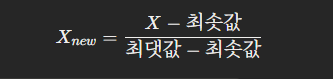
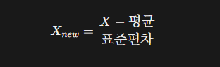
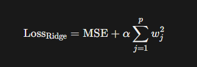
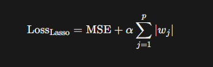

# 머신러닝

>날짜: 2026.08.27
----
## 경사하강법, 옵티마이저 및 데이터 분할

### 오버슈팅 방지!, 데이터 스케일링 분할

#### 스케일링이 필요한 이유 :
집 크기(4,000)이나 값(500,000)처럼 원본 숫자가 너무 크면 인공지능이 곱셈할때 보폭이 꼬여 오버슈팅이 일어남
#### 1. MinMaxScaler
- 가장 큰 값을 1, 가장 작은 값을 0으로 맞추어 데이터를 '0~1 사이로 압축
  

#### 2. StandardScaler
- 평균을 0으로하고 표준편차를 1로 맞춰 평균으로 얼마나 떨어져 있는지 (Z-score)로 변환해주는 도구

### 데이터 분할(Data Split) ex)모의고사
#### 1. 학습세트(Train Set) 
- 모델이 학습하는 데이터 ex) 수학익힘책(평소연습)
#### 2. 검증세트(Validation Set)
- 학습 주기마다 모델을 평가(Loss-> 가중치 조절)하기 위한 데이터 ex) 9월 모의고사(중간 점검)
#### 3. 테스트세트(Test set)
- 모델이 학습을 끝낸후 모델의 성능을 평가하기 위한 데이터 ex) 실제 수능시험(최종 평가용)

### 데이터 분할의 핵심 옵션
- 데이터를 비율에 맞게 섞어서 학습, 평가를 해야한다
- 학습을 적절한 횟수로 시켜야 좋다.
    - 더이상 loss가 떨어지지 않을떄 학습을 종료

#### 데이터 스케일링(숫자 압축)
- 정규화
- 표준점수(Z-score, StandardScaler)

### 다중 회귀
#### $y = w_1x_1 + w_2x_2 + \dots + w_px_p + \mathbf{b}$
1. 강한 특성 -> y의 변화를 크게 한다.(w(가중치)의 값이 크다)
2. 약한 특성 -> y값의 변화가 크지 않다.(w(가중치)의 값이 작다.)
#### 1. L2 규제(Ridge)

- $\alpha$ : 규제 강도 (Hyperparameter)
- 영향력이 큰 가중치에 벌점을 크게 높인다
- 영향력이 작은 가중치는 벌점을 작게 높인다
#### 2. L1 규제(Lasso)

- p: 특성 갯수
- 영향력이 적은 특성의 가중치를 0으로 치환

#### 규제강도
- 로그를 사용
### 특성 공학
- 특성들을 조합해서 새로운 특성을 추가해주는 전처리기법
- 너무 특성의 갯수를 늘리면 -> 과대적합
- 적절하게 늘려야함.

## 오늘 배운내용
- 오늘은 데이터 스케일링부터 데이터 분할, 다중 회귀, 규제, 특성 공학까지 배웠다.

아직 L1, L2 규제나 가중치 같은 부분은 완전히 이해하지 못했지만 어떤 상황에서 써야하는지 조금씩 이해가 되서 괜찮았다.
