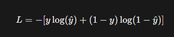
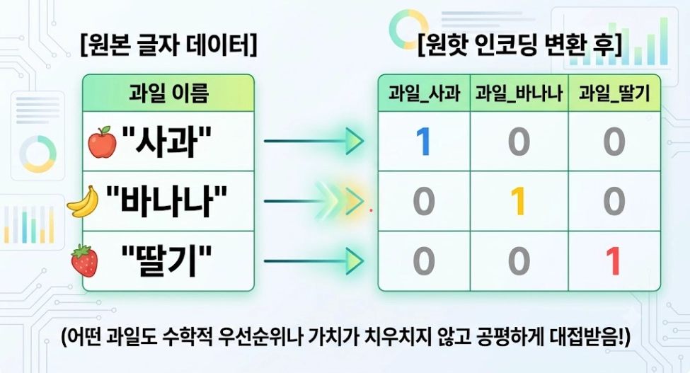

# 머신러닝

>날짜: 2026.08.28

----
## 로지틱스 회귀와 교차 검증
### 로지틱스 회귀
- 회귀방식을 이용한 분류 모델
- 어떤 그룹에 속하는지 분류할때 사용

### 이진 분류
#### 1. 활성화 함수

- 시그모이드
    - 로지스틱 회귀가 계산한 값을 0~1 사이의 확률처럼 바꿔주는 역할
    - 보통은 0.5 기준으로 양성, 음성을 나눈다.
    

#### 2. 손실함수(Loss Function)
- BCE (Binary Cross Entroppy)

- $\hat{y}$: 예측 값 (정답이 1일 확률)
- y: 실제값
- y=1, $\hat{y}$ = 1 -> 분류 틀림
    - 벌점 무한대
- y=1, $\hat{y}$ =1 -> 맞춤
    - 벌점이 낮아짐.
### 다중 분류

#### 1. 활성화 함수
- 소프트맥스
    - 전체 1에서 부분 확률

#### 2.원 핫 인코딩(One-Hot incoding) 
- 엉터리 수학적 서열 관계를 마음대로 상상하고 편향된 가중치를 학습하게 되는걸 방지
- 분류 갯수가 많아지면 메모리가 부족해 진다.
- 연산량도 많아 진다.
- Sparse...(희소)- 내부적으로 확률을  개선
- "Enbedding Layer (실수 밀집 벡터)
    - 정수로 받고 (0, 1, 2, 3)

#### 3. 손실함수(Loss Function)
- CCE 
    - 선택지가 3개 이상인 다중 분류 + 정답이 원-핫 인코딩 형태일 때

        $L = - \sum_{c=1}^{C} y_c \log(\hat{y}_c)$

- SCCE (Sparse Categorical Cross Entropy)
    - 선택지가 3개 이상인 다중 분류 + 정답이 정수형 레이블 형태일 때

   
        $L = - \log(\hat{y}_{target})$

## 다층 퍼셉트론
- 입력 정보가 출력층으로 바로 전달되지 않고, 중간에 정보를 다각도로 연산하는 뉴런 층을 거치는 구조

은닉층에 추가 되는 활성화 함수
1. 선형적 -> 비선형적
2. 시그모이드 함수 (0~1)
    - Gradients 작아짐
    - 가중치 업데이트가 미미
    - 학습이 이루어지지 않음(그래디언트 소실 문제)
3. ReLu 함수 =amx(z, 0)
    - 음수는 0
    - 양수는 그대로 통과