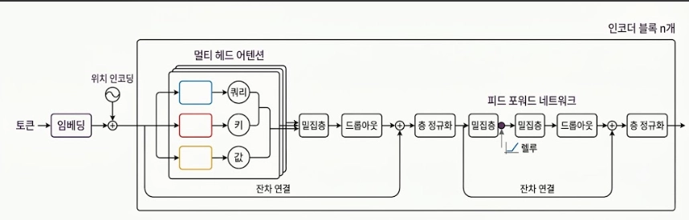
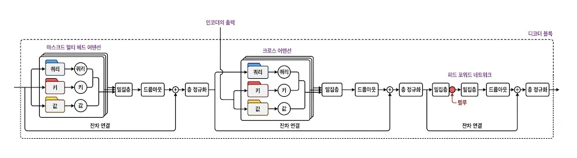

# 머신러닝

> 날짜: 2026.09.01

---

## 시퀀스-투-시퀀스 및 어텐션 기법

### Seq2Seq 아키텍처

1. 순환 신경망(RNN) 계열의 응용
2. 주로 번역 작업을 위해 연구된 구조
3. 인코더-디코더로 구성됨
   - 인코더: 문장을 이해해서 하나의 벡터(컨텍스트 벡터)로 압축
   - 디코더: 그 컨텍스트 벡터를 초기값으로 받아서 문장을 새로 생성

인코더가 "원문을 다 읽고 요약을 만드는 사람"이라면, 디코더는 "그 요약만 보고 번역문을 처음부터 써 내려가는 사람"에 가깝다고 이해하니 감이 잡혔다.

### 디코더의 단어 복원 생성과 교사 강요

디코더는 인코더가 넘겨준 최종 컨텍스트 벡터(hidden, cell)를 자신의 초기 은닉 상태·셀 상태로 그대로 받아서, 거기서부터 번역할 언어의 단어를 한 단계씩 순서대로 예측해나간다.

- 맨 처음 시작할 때는 문장의 시작을 알리는 특수 토큰 `<sos>`를 입력으로 넣는다.
- **교사 강요(Teacher Forcing)**: 디코더가 중간에 단어를 잘못 예측하더라도, 다음 시점의 입력으로는 그 틀린 예측값 대신 **실제 정답 단어**를 강제로 넣어주는 기법. 처음엔 왜 틀린 걸 그냥 두지 않고 정답으로 바꿔치기하나 싶었는데, 생각해보니 한 번 잘못 예측하면 그 오류가 다음, 그다음 단어 예측까지 계속 번져나가기 때문이었다. 학습 초반에 이 오류 누적을 막아서 학습을 훨씬 안정적으로 만들어주는 기법.

### 어텐션 기법

Seq2Seq의 가장 큰 약점은 결국 컨텍스트 벡터 하나에 문장 전체를 욱여넣어야 한다는 점이었다. 문장이 길어지면 정보가 눌리는 걸 계속 봐왔는데, 어텐션이 이 문제를 정면으로 풀어준다.

1. 인코더의 마지막 은닉 상태 하나만 쓰는 게 아니라, **모든 타임스텝의 은닉 상태를 다 보관**해둔다.
2. 디코더가 단어를 하나 생성할 때마다, 그 보관해둔 은닉 상태들 중 **지금 필요한 부분에만 선택적으로 집중**한다. 이 집중 정도를 수치로 나타낸 게 Attention Weight.
3. 이 계산을 위해 세 가지 벡터를 쓴다.
   - **Query**: 지금 무엇을 찾고 싶은가
   - **Key**: 그 정보를 찾기 위한 일종의 이름표
   - **Value**: 이름표(Key)를 통해 실제로 찾아낸 의미
4. 어텐션 연산은 세 단계로 진행된다.
   - 1단계: 유사도 측정 — Query와 각 Key가 얼마나 관련 있는지 계산
   - 2단계: 가중치 분배 — 유사도를 바탕으로 각 위치에 얼마나 집중할지 비중을 정함
   - 3단계: 가중합 계산 — 그 비중대로 Value들을 섞어서 최종 결과를 만듦

---

## 트랜스포머 아키텍처

RNN 기반 Seq2Seq는 결국 "순서대로 읽어야 한다"는 제약에서 못 벗어났는데, 트랜스포머는 이 순서 읽기 자체를 버리고 어텐션만으로 문장 전체를 한 번에 처리하는 구조다. 오늘 그림으로 인코더와 디코더 블록을 각각 뜯어봤다.

### 인코더

토큰이 임베딩되고 위치 인코딩이 더해진 뒤, 멀티 헤드 어텐션과 피드 포워드 네트워크를 거치는 구조.

- **멀티 헤드 어텐션**: 각 단어가 문장 속 다른 단어들과 얼마나 관련 있는지를 직접 계산하는 부분. 여러 개(헤드)를 동시에 계산해서, 문법적 관계·의미적 관계 등 여러 관점을 한 번에 파악한다.
- **잔차 연결**: 층을 깊게 쌓다 보면 원래 정보가 점점 흐려질 수 있는데, "원본도 같이 더해줄게"라고 우회로를 만들어서 정보 손실을 막아준다.
- **층 정규화**: 숫자 값들이 너무 크거나 작아지지 않게 평균과 분산을 일정하게 맞춰주는 작업. 학습을 안정적으로 만든다.
- **밀집층**: 이전에 배운 은닉층과 같은 개념. 숫자를 다른 크기로 변환해준다.

이 전체 블록(어텐션 + 피드포워드)을 하나의 세트로 삼아 여러 겹(n개) 쌓는 게 인코더의 전체 구조.

### 디코더

인코더와 뼈대는 비슷하지만, 결정적으로 다른 두 가지 어텐션이 들어있다.

- **마스크드 멀티 헤드 어텐션**: 기본 구조는 인코더의 어텐션과 같은데, "마스크드"가 핵심 차이다. 디코더는 문장을 한 단어씩 순서대로 생성하기 때문에, 아직 만들지 않은 미래 단어를 미리 참고해버리면 반칙이 된다. 그래서 아직 생성하지 않은 미래 단어는 아예 못 보게 가려버린다.
- **크로스 어텐션**: 이 블록에서 가장 중요한 부분이라고 느꼈다. Query는 디코더 쪽에서 오고, Key·Value는 인코더의 출력에서 가져온다. 즉 디코더가 "지금 뭘 써야 하지?"라는 질문(Query)을 던지면, 인코더가 이해해둔 원문 정보(Key, Value)에서 관련된 부분을 찾아와 참고하는 구조다. 번역가가 문장을 쓰다가 막히면 원문을 다시 한번 들여다보는 것과 비슷한 느낌.

인코더와 디코더를 합쳐보면, 결국 "인코더가 원문을 이해해서 정보를 만들어두면, 디코더는 그 정보를 크로스 어텐션으로 계속 참고하면서 새 문장을 한 단어씩 만들어나가는" 구조라는 게 오늘 가장 크게 이해된 부분

---

## 오늘의 느낀 점

- Seq2Seq의 컨텍스트 벡터 하나짜리 구조가 왜 한계였는지 체감한 다음에 어텐션 얘기를 들으니까 훨씬 자연스럽게 이어졌다. "모든 은닉 상태를 다 보관해뒀다가 필요한 부분만 골라 쓴다"는 아이디어가 결국 트랜스포머까지 그대로 이어진다는 걸 알고 나니, RNN → Seq2Seq → 어텐션 → 트랜스포머로 이어지는 흐름이 하나로 연결됐다.