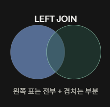
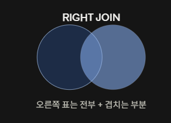

# SQL & DB

> 날짜: 2026.09.07

## 데이터 조회

### DML - SELECT (조회)
```sql
SELECT 컬럼1, 컬럼2 FROM 테이블명 [,테이블명...] [WHERE 조건식]
```

- ALL (기본값, 중복 포함한 전체)
- DISTINCT (중복 없이 조회)

#### WHERE 조건식
- 조회의 범위를 좁힌다.
1. 비교 연산자 (>, <, >=, =)
2. 논리 연산자 (AND, OR, NOT)
3. IN : 포함 여부, NOT IN(...)
4. BETWEEN A AND B : A에서 B사이
5. IS NULL : 값이 빈 상태인지 체크
6. IS NOT NULL : 값이 있는 상태인지
   - NULL은 값이 없는 상태이므로 비교, 산술 등의 연산이 불가

#### CASE WHEN
- 조건에 따라 다른 값을 부여하는 경우
```sql
SELECT CASE WHEN 조건식1 THEN 결과1
            WHEN 조건식2 THEN 결과2
            ELSE 결과 (모든 조건이 거짓일 때 값)
       END AS 새로운컬럼명
FROM 테이블명 ... ;
```

#### AS : 별칭 / 생략 가능
- 컬럼명 뒤에 -> 다른 컬럼명으로 변경
- 테이블명 뒤에

#### 키워드 검색 
```
1. LIKE "키워드" : 키워드에 정확한 매칭
2. LIKE "키워드%" : 키워드로 시작하는 패턴
3. LIKE "%키워드": 키워드로 끝나는 패턴
4. LIKE "%키워드%" : 키워드가 포함된 패턴 
```


#### 결과값 정렬
```sql
ORDER BY 컬럼명 [ASC/DESC] [, 컬럼명 ...]
```
- ASC : 오름차순
- DESC : 내림차순

예) `ORDER BY product_name ASC, list_price DESC`
- 상품명으로 오름차순 정렬 -> 같은 정렬 순서면 -> 가격을 가지고 내림차순 정렬

## 데이터 집계와 분석

### 통계(집계)

#### 1. 집계함수
1. COUNT(컬럼명) : 레코드 개수
2. SUM(컬럼명) : 합계
3. AVG(컬럼명) : 평균
4. MIN(컬럼명) : 최소값
5. MAX(컬럼명) : 최대값

#### 2. GROUP BY
```sql
SELECT .... FROM ... WHERE ... GROUP BY ...
```
1. 특정 컬럼 기준으로 그룹을 만든다.
2. 집계함수와 함께 쓰이는 경우가 많다.
3. 레코드 개수는 그룹핑된 결과 개수만큼 조회
4. 조회 컬럼은 반드시 GROUP BY에 명시된 컬럼만 사용 가능
5. 집계함수를 포함한 조건은 절대 WHERE절에서 사용 불가
   - `GROUP BY __ HAVING (집계함수 조건)`

### RDBMS
관계형 데이터베이스

#### 집합
- 중복 허용 X
1. 합집합: UNION (중복 제거, 합침)
   - UNION ALL : 중복 허용
2. 교집합: 공통적인 것 INTERSECT
3. 차집합: EXCEPT

```sql
SELECT .... FROM 테이블1 [, 테이블2, ...]
```

#### JOIN
두 테이블에서 공통적인 값을 기준으로 테이블을 하나처럼 조회되도록 결합해주는 것

1. `INNER JOIN` : 동등조인(교집합), 내부조인
   - INNER 키워드는 생략 가능

2. `[OUTER] JOIN` : 외부조인

ex) 매장 목록을 조회하는데 주문이 있다면 주문도 같이 출력

- `LEFT OUTER JOIN`



- `RIGHT OUTER JOIN`



- `FULL OUTER JOIN`
1. 양쪽 테이블 모두 주 테이블로 취급해서 다 나온다.

```sql
SELECT .. FROM .. LIMIT ..
```
- LIMIT 조회할 행수 [OFFSET 시작 인덱스번호]
- `LIMIT 10 OFFSET 0;`

## 오늘의 느낀점
- DML에서의 조회가 실무에서 가장 쓸 일이 많다는 것에 대해서 알게되었다.
- WHERE에는 집계함수를 쓰면 작동이 안되는 것을 알았다!